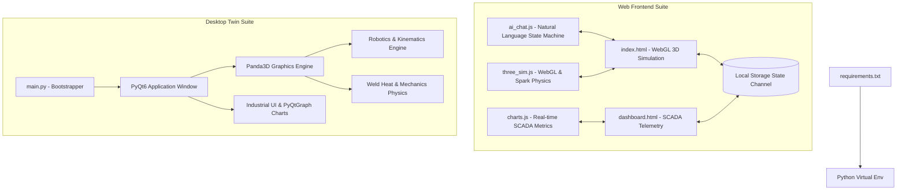

# ⚙️ WeldForge-X: Industrial Hybrid Digital Twin & Weld AI Forge

Welcome to **WeldForge-X**, the ultimate Industrial 4.0 Hybrid Digital Twin and open-ended Weld AI Forge. This system blends real-time mechanical simulation, physical modeling, state-of-the-art robotics visualization, and a smart telemetry dashboard powered by an interactive Conversational AI engine.

WeldForge-X operates in two modes:
1. **Desktop Native (PyQt6 + Panda3D)**: High-performance 3D robotic physics modeling, simulation sweeps, and Qt-based industrial dashboard interface.
2. **Web-Based (WebGL/Three.js + HTML5)**: Lightweight, premium glassmorphic web browser digital twin, synchronized via localized cross-tab communication (`localStorage` channels) with the Siemens-style telemetry suite and the conversational Weld AI chat assistant.

---

## 🚀 Key Features

### 1. 🤖 Open-Ended "Weld AI Forge"
* **Natural Language Compiling**: Command the AI in conversational terms (e.g., *"weld two pieces of 50 cm titanium lap joint using precision TIG"*).
* **Conversational Dimension Guardrails**: An intelligent dialogue state machine prompts for missing parameters (Length: 10-68cm, Width: 2-20cm, Thickness: 2-50mm) and clamps inputs within safe boundaries.
* **Procedural Materials Engine**: Dynamically hashes *any* arbitrary metal name to unique WebGL physical properties (Colors, Yield Strength, Thermal Conductivity, etc.).

### 2. ⚡ Real-Time WebGL/Three.js Simulation
* **Procedural Spark & Spatter Physics**: Zero-sparks for Friction/Laser welding, heavy sparks and spatter for Shielded Metal Arc (Stick), and focused precision arcs for TIG/MIG.
* **Thermal Heat Map Glow**: Visualizes thermal gradients along the weld seam in real-time, utilizing incandescent red-orange glows for solid-state friction and neon-arc illumination for high-energy processes.
* **Dynamic Robotic Arm Sweeps**: Simulates multi-axis inverse kinematics (IK) robotic weld sweeps directly aligned with the seam geometry.

### 3. 📊 Premium SCADA & Telemetry Suite
* **Siemens-Style Visuals**: Clean, modern dark/white studio themes featuring glassmorphism, glowing micro-animations, and high-frequency real-time line charts (Weld Current, Voltage, Speed, and Temperature).
* **Advanced Mathematical Equations**: Displays solved physical variables using premium SCADA formulas (e.g., Arc Heat Input $H = \eta \cdot \frac{U \cdot I}{v}$, Solid-State mechanical heat $H = \frac{P_{\text{friction}}}{v}$, and Ultimate Joint Tensile Strength $F_{\text{limit}} = \sigma_{\text{yield}} \cdot A_{\text{seam}} \cdot \eta_{\text{joint}}$).
* **Metallurgical Health Alerts**: Warns users of thermal cracking risks, excessive cooling rates, and required preheating temperatures for high-carbon or exotic alloys.

---

## 🛠️ Architecture & Tech Stack



---

## 🏁 Getting Started

### Prerequisites
* **Python 3.10+**
* A modern web browser supporting WebGL 2.0 (Chrome, Edge, Firefox, or Safari).

### Setup and Running the Web Application (WebGL Twin)
1. **Initialize Environment**:
   Run `setup_env.bat` to create a local virtual environment (`.venv`) and automatically install all required python libraries.
   ```bash
   setup_env.bat
   ```

2. **Launch the Application**:
   Run `start.bat` to initiate the local server and automatically open the application in your web browser.
   ```bash
   start.bat
   ```
   * The 3D Digital Twin simulation runs at `http://localhost:8000`
   * The Siemens Telemetry Dashboard runs at `http://localhost:8000/dashboard.html`

### Running the Desktop Native Application (PyQt6/Panda3D)
To run the python desktop application, activate the virtual environment and execute `main.py`:
```bash
.venv\Scripts\activate
python main.py
```

---

## 📂 Repository Structure
```
weldforge_x/
│
├── weldforge_x/            # Core Python desktop source package
│   ├── core/               # Robotics, physical engines, simulation controllers
│   ├── database/           # Material specifications and metallurgy data
│   └── ui/                 # PyQt6 widgets, SCADA design, and dashboard panels
│
├── js/                     # Web application engine files
│   ├── ai_chat.js          # conversational state machine & SCADA formulas
│   ├── charts.js           # high-speed chart drawing & remote dashboard triggers
│   └── three_sim.js        # Three.js 3D viewport, shaders, and particle pipelines
│
├── index.html              # Simulation twin interface
├── dashboard.html          # Siemens-style telemetry panel
├── style.css               # Premium CSS glassmorphic stylesheet
├── main.py                 # Desktop app entry point
├── requirements.txt        # System requirements
├── setup_env.bat           # Auto-environment setup utility
└── start.bat               # Digital twin server launcher
```

---

## 📜 License
This project is licensed under the MIT License - see the LICENSE file for details.
